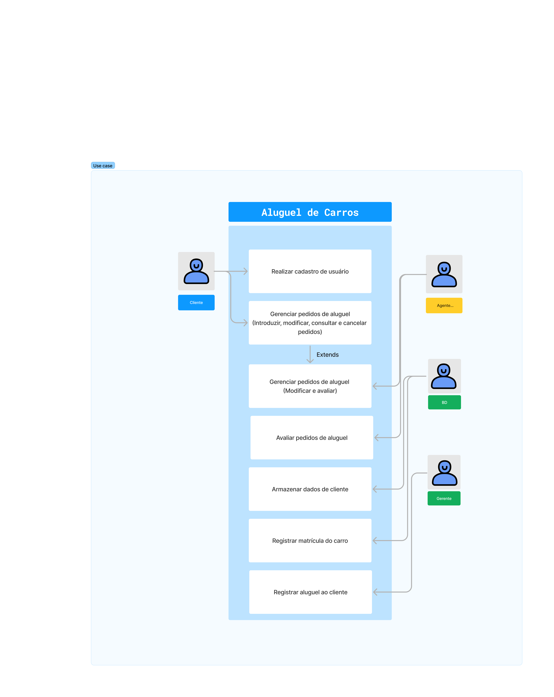

# Projeto de sistema de aluguel AlugaAi

Este projeto foi desenvolvido para a matéria de Projetos de Software, do curso de Engenharia de Software da Pontifícia Universidade Católica de Minas Gerais. Se tratando do desenvolvimento de um sistema de aluguel de carros informatizado

---

## Diagrama de casos de uso

|  |
|:---------------------:|
| Diagrama de casos de uso |

## Diagrama de classes 
|  |
|:---------------------:|
| Diagrama de classes |


## Estrutura de Pacotes e Classes

```

```

## Histórias de usuário

| Usuário    |  Necessidade   | A fim de    |
|-------------|-------------|-------------|
| Cliente |  Escolher o carro ideal de acordo com suas preferências  | Escolher um carro que atenda todas as suas necessidades   |
| Cliente | Realizar um pedido de aluguel online | Poupar tempo de deslocamento a locadora para realizar o requisito|
| Cliente| Visualizar o status de seu pedido de aluguel online | Acompanhar o status de ser pedido sem a necessidade de interagir com um funcionário |
| Cliente | Editar informações do pedido de aluguel online | Editar o seu pedido de aluguel sem necessidade de entrar em contato com um funcionário | 
| Agente | Autorizar pedidos de aluguel digitalmente | Poupar tempo analisando pedidos de aluguéis  |
| Gerente | Atribuir um carro alugado a um cliente digitalmente | Ter maior controle sobre os carros que foram alugados
| Gerente | Gerenciar métodos de pagamento de clientes | Centalizar operações envolvendo pagamentos e a possibilidade de um pagamento ser feito por meio de uma linha de crédito de bancos |
| Gerente | Gerenciar dados pertinentes de clientes | Ter maior controle sobre informções de clientes |
| Gerente | Gerenciar a frota de veículos | Centralizar informações da frota de veículos para controle de estoque e revisões|
| Gerente | Gerenciar o status de devolução dos carros alugados | Garantir que todos os carros sejam devolvidos no prazo e em boas condições, para que possam ser rapidamente disponibilizados para outros clientes. |
| Gerente |  Gerenciar promoções e descontos no sistema | Oferecer ofertas especiais para atrair mais clientes  |


## Links Uteis

- [Diagrama de Casos de Uso no Figma]([https://www.figma.com/board/wF6VISE7wazLz5nLJRs01S/Use-Case-(Copy)?node-id=0-1&t=9BhIaHnJ9eTdwW5z-1](https://www.figma.com/board/yTKvLwomu31T4yBHM11T7S/Use-Case-Template-(Community)?node-id=0-1&p=f&t=XihTXQdGBsxlMuV3-0))
- [Diagrama de Classes no Figma](https://www.figma.com/board/SFUK5CWMCommWkiJO6hWZj/Class-Diagram-Template-(Community)?node-id=3-923)
